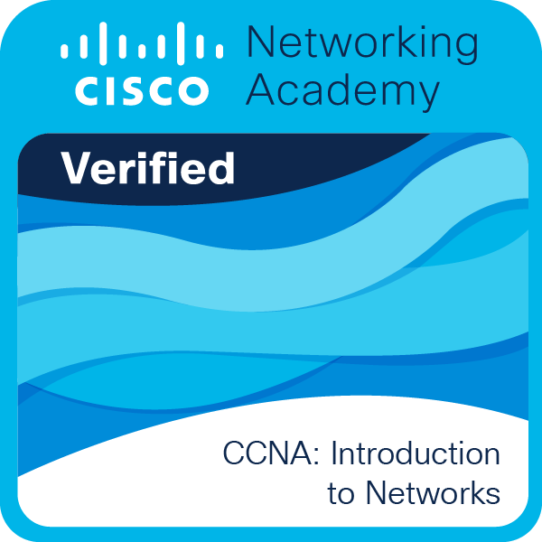
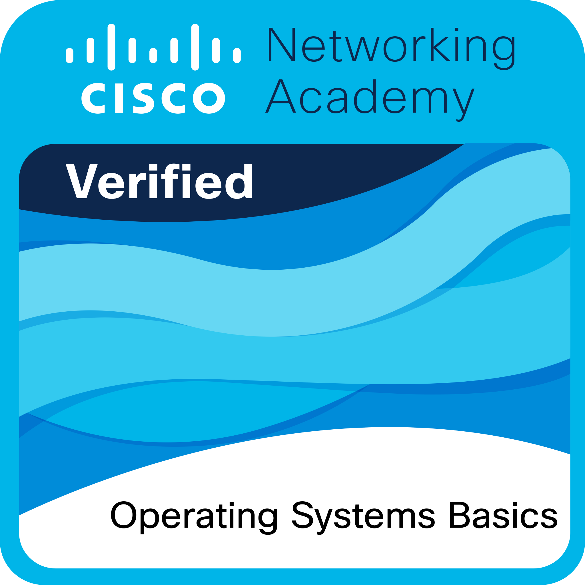

<div align="center">
  
</div>

<h3 align="center">🚀 Passionate Full Stack Developer from Indonesia 🇮🇩</h3>

<p align="center">
  
  
</p>

<div align="center">
  
</div>

---

### 👨‍💻 About Me

<table>
  <tr>
    <td valign="top" width="60%">

```typescript
const aryaWiguna = {
    location: "Indonesia 🇮🇩",
    role: "Full Stack Developer",
    currentlyLearning: ["Laravel", "ASP.NET VB", "PostgreSQL"],
    askMeAbout: ["React", "Vue", "Laravel", "Flutter"],
    technologies: {
        frontend: ["React", "Vue.js", "Next.js", "Angular", "TypeScript"],
        backend: ["Node.js", "PHP", "Python", "Go", ".NET"],
        mobile: ["Flutter", "React Native", "Ionic"],
        databases: ["PostgreSQL", "MySQL", "MongoDB", "MariaDB"],
        devOps: ["Docker", "Git", "Nginx"],
        design: ["Figma", "Photoshop", "Blender"]
    },
    blog: "aryawgnablogaddress.blogspot.com",
    funFact: "I think I am introvert 🤫"
};
```

    </td>
    <td valign="center" width="40%">
      <div align="center">
        
      </div>
    </td>
  </tr>
</table>

### 📊 Current Focus

🎯 Building scalable full-stack applications  
📚 Deepening my knowledge in **Laravel** & **PostgreSQL**  
✍️ Writing technical articles on my [blog](https://aryawgnablogaddress.blogspot.com)  
🌱 Exploring cloud technologies and DevOps practices

### 🌐 Connect With Me

<p align="center">
  <a href="https://linkedin.com/in/arya-wgna" target="_blank">
    
  </a>
  <a href="mailto:wgnarya123@gmail.com">
    
  </a>
  <a href="https://aryawgnablogaddress.blogspot.com" target="_blank">
    
  </a>
  <a href="https://github.com/AryaWgna" target="_blank">
    
  </a>
</p>

---

### 🛠️ Tech Stack & Tools

#### Frontend Development
<p align="center">
  
  
  
  
  
  
  
  
  
  
</p>

#### Backend Development
<p align="center">
  
  
  
  
  
  
  
  
  
</p>

#### Mobile Development
<p align="center">
  
  
  
  
  
</p>

#### Database & Tools
<p align="center">
  
  
  
  
  
  
</p>

#### DevOps & Other Tools
<p align="center">
  
  
  
  
  
  
  
</p>

---

### 📈 GitHub Statistics

<div align="center">
  
  
</div>

<div align="center">
  
  
</div>

<div align="center">
  
</div>

<div align="center">
  
</div>

---

### 💼 Featured Projects

<div align="center">

<table border="0">
  <tr>
    <td width="50%" align="center">
      <a href="https://github.com/AryaWgna/Speech-To-Text">
        <h3>🎙️ Speech-To-Text</h3>
      </a>
      <p>Voice Recognition to Text Converter</p>
      
    </td>
    <td width="50%" align="center">
      <a href="https://github.com/AryaWgna/Arya-intelligence">
        <h3>🤖 Arya-intelligence</h3>
      </a>
      <p>AI Flask Application</p>
      
      
    </td>
  </tr>
  <tr>
    <td width="50%" align="center">
      <a href="https://github.com/AryaWgna/Dashboard-Framework">
        <h3>📊 Dashboard-Framework</h3>
      </a>
      <p>React and Next.js Dashboard</p>
      
    </td>
    <td width="50%" align="center">
      <a href="https://github.com/AryaWgna/Calculator-Split">
        <h3>💰 Calculator-Split</h3>
      </a>
      <p>Bill Splitting Calculator</p>
      
      
    </td>
  </tr>
  <tr>
    <td width="50%" align="center">
      <a href="https://github.com/AryaWgna/go-restapi-gin">
        <h3>🔌 go-restapi-gin</h3>
      </a>
      <p>REST API with Gin Framework</p>
      
    </td>
    <td width="50%" align="center">
      <a href="https://github.com/AryaWgna/FlutterSchools">
        <h3>📱 FlutterSchools</h3>
      </a>
      <p>School Management App</p>
      
      
    </td>
  </tr>
</table>

</div>

---

### � Certificates

<div align="center">

| **CCNA: Introduction to Networks** | **English for IT 1** | **Operating Systems Basics** |
|:----------------------------------:|:--------------------:|:----------------------------:|
|  |  |  |
| *Covers networking architecture, models, protocols, and elements.* | *Focuses on terminology and communication skills essential for the IT industry.* | *Fundamentals of operating systems, including management of hardware and software resources.* |

</div>

---

### �🐍 Contribution Snake Animation

<div align="center">
  <picture>
    <source media="(prefers-color-scheme: dark)" srcset="https://raw.githubusercontent.com/AryaWgna/AryaWgna/output/github-contribution-grid-snake-dark.svg">
    <source media="(prefers-color-scheme: light)" srcset="https://raw.githubusercontent.com/AryaWgna/AryaWgna/output/github-contribution-grid-snake.svg">
    
  </picture>
</div>

---

### 📊 Contribution Graph

<div align="center">
  
</div>

---

<div align="center">
  
### 💭 Random Dev Quote


### 😄 Random Dev Meme


---

<p align="center">
  
</p>

**💙 If you like my work, consider giving a ⭐ to my repositories!**

<p align="center">
  <i>⚡ "Code is like humor. When you have to explain it, it's bad." – Cory House</i>
</p>

</div>

